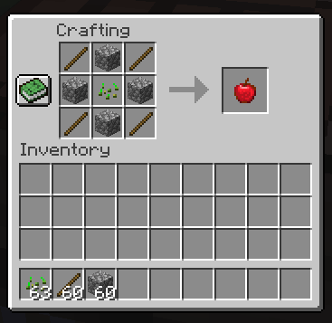

# AppleGOD
Version 0.0.6  |  Spigot 1.16.3

Spigot plugin
https://www.spigotmc.org/resources/applegod.68729/

Minecraft Vanilla 1.8.1
https://minecraft.curseforge.com/projects/applegod

## Information & how to's
Just a mod to make apples. Instead of going to a mine/farming.
It combines the fun of crafting and not getting the apple for free. The apples are craftable from within the servers recipes, therefore you can see how an apple is crafted. Now no more worries about finding apples.

I will update the plugin when needed. Feel free to join the Discord server.
https://discord.gg/3zKZnmN

### Crafting an apple

YourKit supports open source projects with innovative and intelligent tools
for monitoring and profiling Java and .NET applications.
YourKit is the creator of <a href="https://www.yourkit.com/java/profiler/">YourKit Java Profiler</a>,
<a href="https://www.yourkit.com/.net/profiler/">YourKit .NET Profiler</a>,
and <a href="https://www.yourkit.com/youmonitor/">YourKit YouMonitor</a>.
